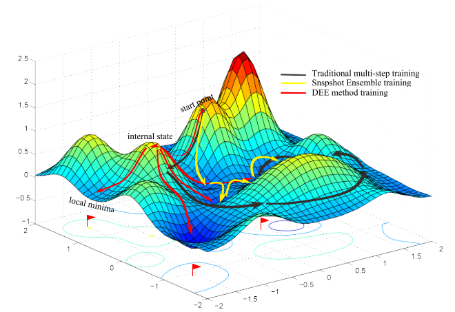
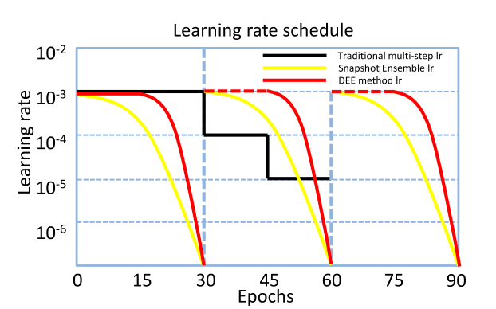
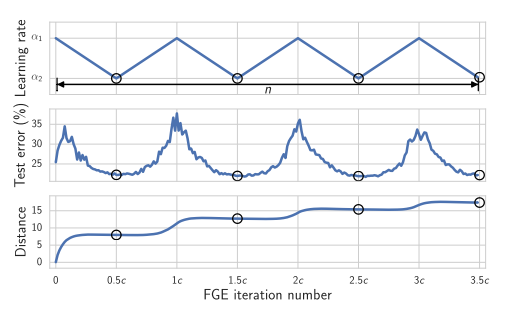

Title: 深度学习集成方法Ensemble汇总
Date: 2018-11-15 22:18:30
slug: Deep-learning-ensemble-methods
category: 深度学习   
tags: 深度学习, 机器学习, 人工智能  
Modified: 2018-11-25 22:18:30

[TOC]

# 概述

[介绍](http://cs231n.github.io/neural-networks-3/#ensemble)

1. 同种模型， 各自初始化
2. 交叉验证得到的不同模型
3. 一个模型，不同检查点checkpoints
4. 训练过程的权重平均

# 1. 同种模型，各自初始化

## Deep Ensemble

[论文][1]

# 2. 一个模型， 不同检查点

## Snapshot Ensemble

[论文][2]

## DEE

Diversity Encouraging Ensemble

[论文][3]

## FGE

Fast Geometric Ensembles

[论文][4]

# 4. 训练过程的权重平均

## Temporal Ensemble

[论文][5]

原论文用于半监督学习， 但思想仍是把训练过程得到的W 权重求平均，或者叫 momenteum?

[1]: http://arxiv.org/abs/1612.01474    "Lakshminarayanan, Balaji, Alexander Pritzel, and Charles Blundell. 2016. “Simple and Scalable Predictive Uncertainty Estimation Using Deep Ensembles.” (Nips)."
[2]: http://arxiv.org/abs/1704.00109    "Huang, Gao et al. 2017. “Snapshot Ensembles: Train 1, Get M for Free.” : 1–14. "
[3]: https://ieeexplore.ieee.org/stamp/stamp.jsp?tp=&arnumber=8296802    "Hao, Yang, Yuan Chunfeng, Xing Junliang, and Hu Weiming. 2017. “DIVERSITY ENCOURAGING ENSEMBLE OF CONVOLUTIONAL NETWORKS FOR HIGH PERFORMANCE ACTION RECOGNITION.” : 2846–50."
[4]: https://arxiv.org/pdf/1802.10026.pdf    "Garipov, Timur, Pavel Izmailov, Dmitrii Podoprikhin, and M L Oct. 2018. “Loss Surfaces , Mode Connectivity , and Fast Ensembling of DNNs.” (Nips): 1–17."
[5]: http://arxiv.org/abs/1610.02242    "Laine, Samuli, and Timo Aila. 2016. “Temporal Ensembling for Semi-Supervised Learning.” (2015): 1–13."